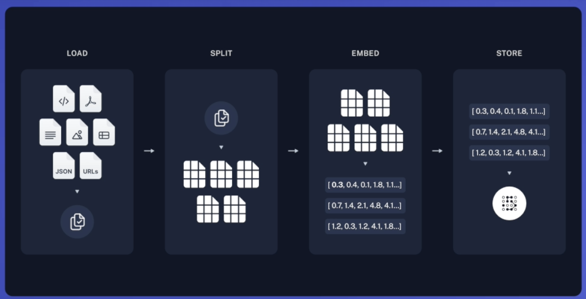
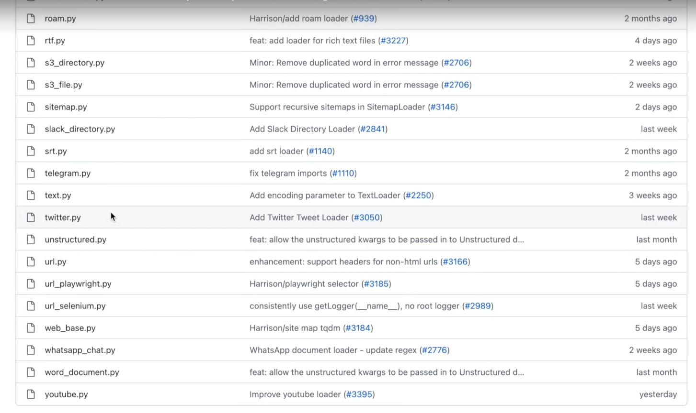
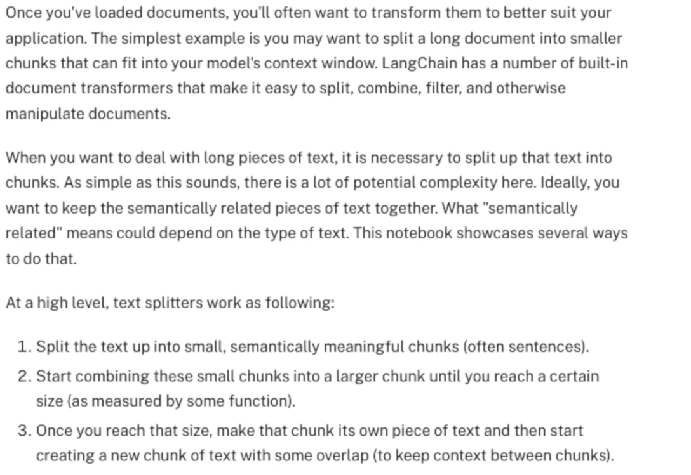

## Overview

Load -> split -> Embedd -> store in vectoreBD
- Loading the medium blog- (TextLoader)
- Splitting the blog into smaller chunks- (TextSplitter)
- Embed the chunks and get vectors- (OpenAIEmbeddings)
- Store the embeddings in Pinecone vectorstore (PineconeVectorStore)

Source: AUTHOR

## Why are TextLoaders needed ?
- LLMs take text as input 
- But what if we want to process text from wahtsappp message, gogole drive, notion notebook, any pdf online etc...
- All the above mentoned sources are basically text
- But the come inn different format and have different semantic meaning
- So doc loaders are classes jmplemetation on to process and load different data and make it digestable by the LLMs

Description: some of doc loaders provided by Langchain (source: Langchain official docs)

## TextSplitters ?

source: Langchain official docs

## Embeddings
sentences(text) ---->  [encoder/ embedding model] ----> O O O O O (vector spaces)

### - This is what embeddings in vector space looks like
### - vector spaces can be visualized in 2D or 3D for simplicity, Pinecone primarily operates in high-dimensional spaces to effectively handle the complexities of modern machine learning data.

SOURCE: AUTHOR

- If the emneddings are placed closer that means they have similar sematic meaning and are related to each other
- The red cluster is the query which is convertedd to text embedding(from text format)
- The red cluster is then placed in vector space
- The vector near the red vector(question) could have the answer to the query
- Then the relevant vector are calculated using cosine/ euclidean formula
- Shorter the distance more relevant the info to the question
- Finally, the relevant vecotrs with significant semantic meaning are converted into text(context) 
-  text spilt into chunks and augmented into prompt
-  BEFORE RETRIVAL: PROMPT -> Query
-  AFTER RETRIVAL: PROMPT -> Query + Context(chunks)

